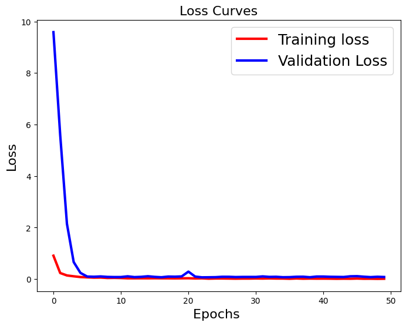
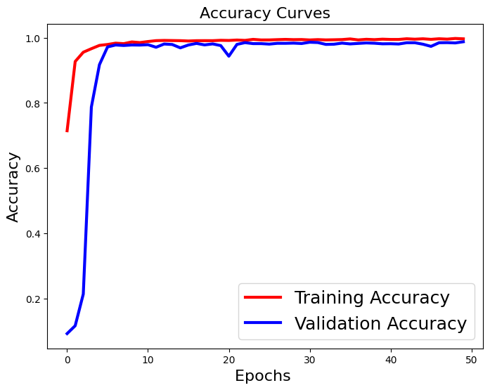

# Bangla Vowel Detection Using Deep Learning

## Overview

This project demonstrates a deep learning-based approach to Bangla vowel detection using the Ekushe dataset. The solution leverages **ResNet50**, a pre-trained convolutional neural network, and data augmentation techniques to improve the model's performance.

The notebook is designed to:
- Preprocess Bangla vowel dataset images.
- Train a deep learning model with advanced architectures.
- Evaluate and visualize the performance of the trained model.
- Predict vowel classes for new images.

## Table of Contents

1. [Dataset](#dataset)  
2. [Dependencies](#dependencies)  
3. [Workflow](#workflow)  
4. [Model Architecture](#model-architecture)  
5. [Results](#results)  
6. [How to Run](#how-to-run)  
7. [License](#license)

## Dataset

The dataset used for this project is the **Ekushe Bangla Alphabet Dataset**, organized into:

- **Training Set**: Contains images of Bangla vowels for training the model.
- **Testing Set**: Contains images for evaluating the trained model.

Dataset structure:

Each folder corresponds to a class label.

## Dependencies

The following Python libraries are required to run this project:

numpy
pandas
matplotlib
seaborn
tensorflow
keras
opencv-python
joblib
tqdm

To install all dependencies, use:pip install -r requirements.txt

---

### Cell 5: Workflow

## Workflow

### 1. Data Preprocessing
- **Normalization**: Rescale pixel values to [0, 1].
- **Noise Reduction**: Applied bilateral filtering.
- **Pseudocoloring**: Applied `cv2.COLORMAP_BONE` for enhanced feature visualization.
- **Resizing**: Images resized to 64x64 pixels for compatibility with ResNet50.

### 2. Data Augmentation
- Used **ImageDataGenerator** for random rotations, shifts, and flips to improve generalization.

### 3. Model Training
- Base model: **ResNet50** (pre-trained on ImageNet).
- Top layers: Global Average Pooling, Dropout, and Dense layers.
- Optimizer: Adam with learning rate 0.0001.
- Loss Function: Categorical Crossentropy.

### 4. Evaluation
- Evaluated on test data using accuracy and loss metrics.
- Visualized results with loss and accuracy curves.

### 5. Prediction
- Predicted class labels for new input images.

## Model Architecture

The model is based on ResNet50 with custom top layers added for classification. Key layers:

1. Pre-trained ResNet50 base (without the fully connected layers).
2. GlobalAveragePooling2D layer.
3. Dropout (rate=0.4).
4. Dense layer with softmax activation for classification into 11 classes.

Model Summary:
- Total Parameters: 23,610,251  
- Trainable Parameters: 23,557,131  

## Results

- **Test Accuracy**: 97.76%  
- **Test Loss**: 0.1440  

### Training Curves
  

## How to Run

1. Clone the repository:

   git clone https://github.com/<your-username>/bangla-vowel-detection.git
   cd bangla-vowel-detection

# Replace 'image_path' with the path to your image
image_path = 'path/to/image.jpg'
predictions = model.predict(image_path)
print("Predicted class:", predictions)

---

### Cell 9: License

## License

This project is licensed under the MIT License. See the `LICENSE` file for details.

